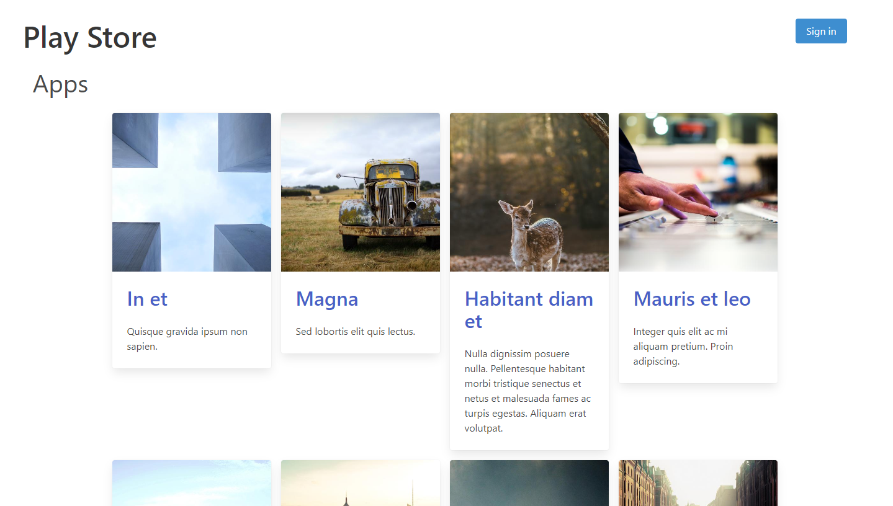
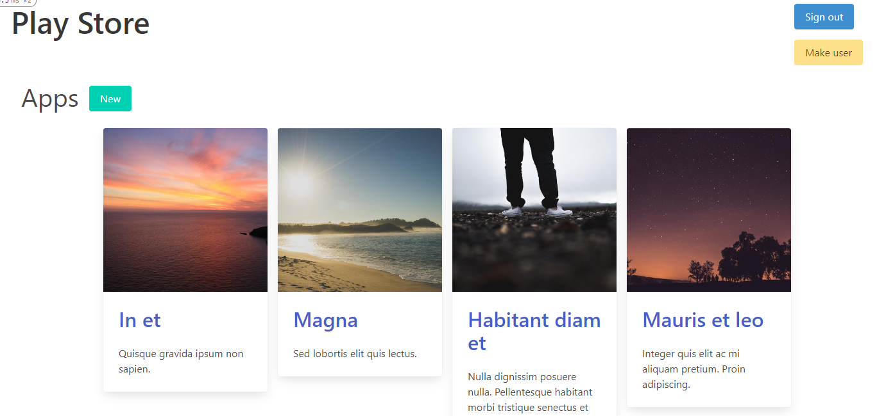
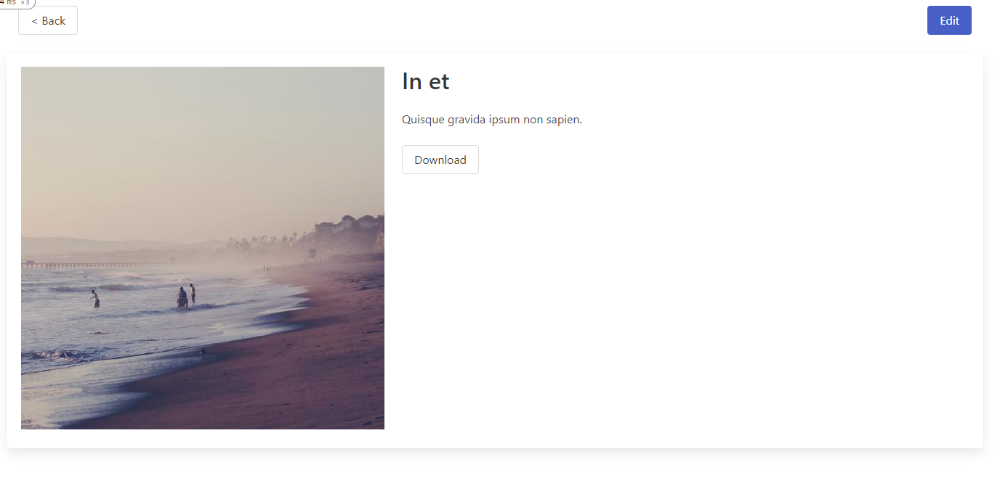
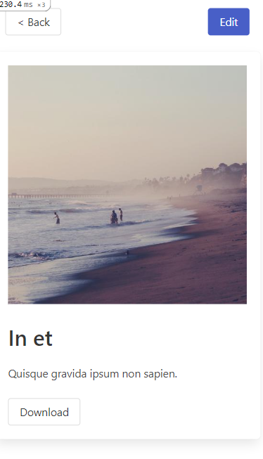

# Play store

```
ruby 2.7.3
rails 6.1.6
css library: [bulma](https://bulma.io/)
```


## User roles

The user model has a `role` column in the database in which we store what role he has.
If a visitor is not signed in, they will have no role and will be able just to view apps and games. If a visitor creates an account, the default role for every user is `user`. With this role they can view games and apps and access the download page.
To make your role a `publisher` there is a special button on the store main page `Make publisher`. In this role there appears a possibility to edit and create games and apps.

## Access restriction

The posibility to download, create and edit games and apps is controlled in the coresponding controllers by having a `before_action :authenticate_user!` and `before_action :check_role`.
`authenticate_user!` restricts access if the visitor in not authenticated.
`check_role!` redirects to main page if a user with `user` role tries to access `edit` or `new` resources.

## Publisher actions

The publisher is able to create games and apps by clicking the new button near the apps section or games section.


When creating an app or game the publisher should specify the title and the description, additionally after the app or game is created the `url` is generated. This `url` is a bash64 string combining the type of content and the id, ex: base64("app:123"). This string is then used by the download controller and it checks if there is an user logged in then it grants access to download.

## Responsivness

Using the `bulma` css library allows us to create a layout based on columns that is responsive to diferent screen sizes.


